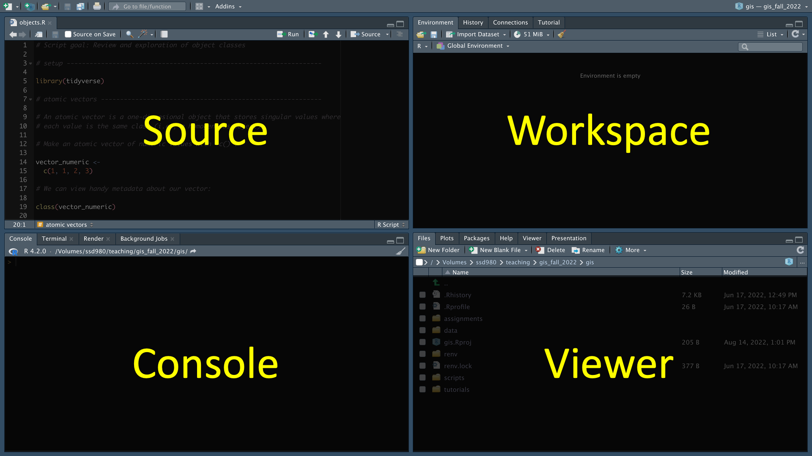
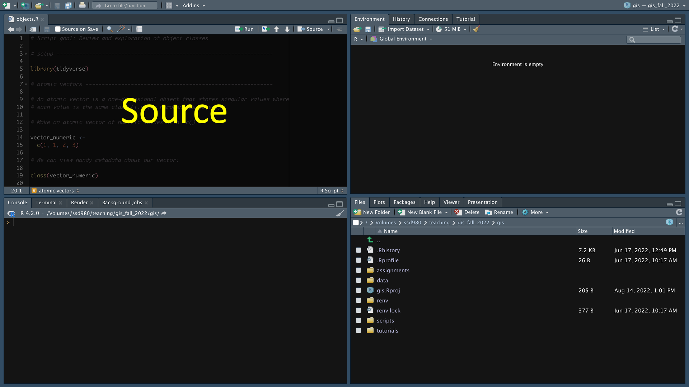
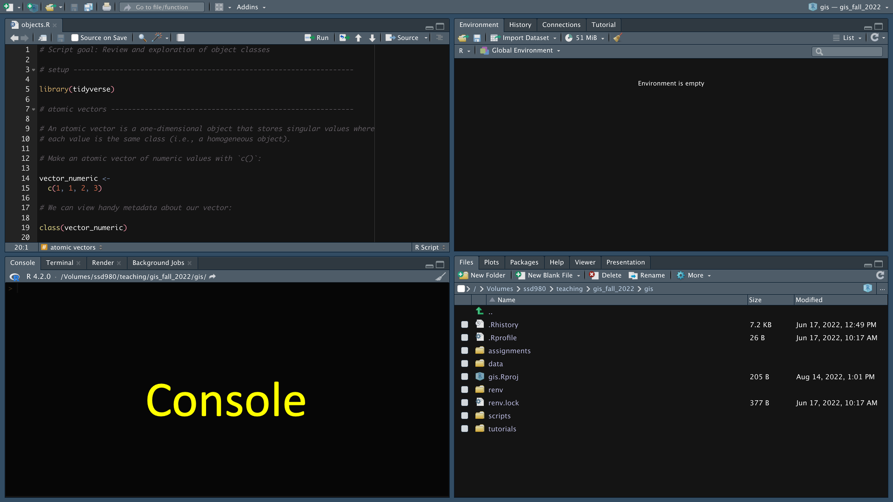
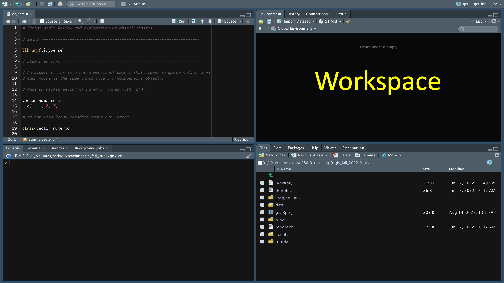
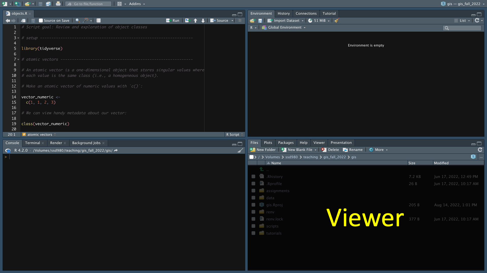
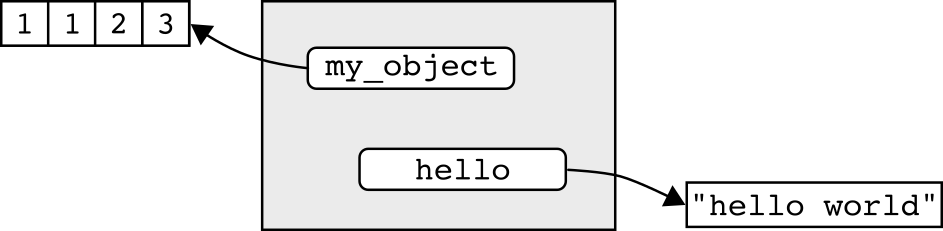
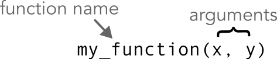
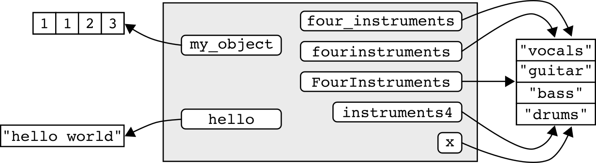
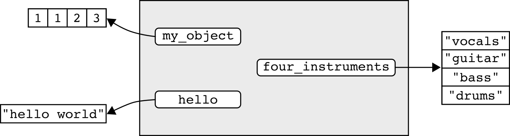
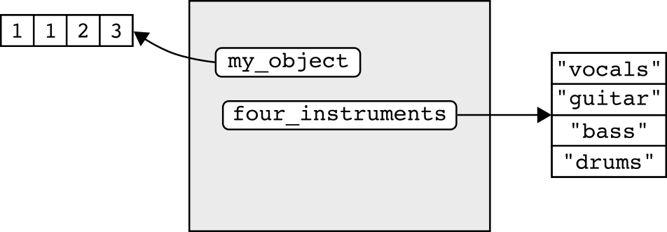

<head>
  <meta 
    name="viewport" 
    content=
      "width=100vw, 
      initial-scale=1,
      maximum-scale=1" />
  <link 
    rel="stylesheet"  
    href="https://cdnjs.cloudflare.com/ajax/libs/font-awesome/4.7.0/css/font-awesome.min.css">
  <link rel="shortcut icon" href="images/data_sci_hex_logo.png" />
</head>

```{r setup, include=FALSE}
library(learnr)
library(fontawesome)
```

## Overview

:::{.row}


Program `r fa("r-project", fill = "steelblue", height = "1.5em")` is a computer language that identifies itself as "a language and environment for statistical computing and graphics". Members of the R community have extended this functionality to address a wide array of applications, from data engineering and management to using R as a Geographic Information System (GIS).  

The introductory documents in this series will begin to prepare you for the material presented in this course. Even if you are entering this class with loads of R experience, please thoroughly read and complete each lesson, as they may contain unfamiliar terminology or concepts. 

In this first lesson, we'll begin our dive into the world of R programming by exploring the fundamentals of code execution, the structure of R, and functions.
:::

### Navigating preliminary course content

Throughout these preliminary lessons there are a number of icons and formats to pay special attention to:

* Key **vocabulary terms** are provided in bold-face font.

* [Keyboard shortcuts and file paths are provided in the Courier font-family.]{style="font-family: monospace;"}

*  :::{style="font-family: monospace; background-color: #f0f0f0; font-size: 0.75em;"}
Sections that appear exactly as they would in R are provided in the Courier font-family and are highlighted in dark gray.
:::


* :::{.now_you}
<i class="fa fa-user-circle"></i>
Sections where user input is necessary start with a user circle icon and are highlighted in blue.
:::

* :::{.secret-div}
<i class="fa fa-user-secret"></i> 
Tips and tricks start with a user secret icon and are highlighted in light gray.
:::

<hr style="border-width: 5px;">

## 1. Installing R and the RStudio

:::{.row}
</img>

In this course, we will use R within the RStudio IDE (Integrated Development Environment). RStudio is an interface to R and Python (and a number of other computer languages) that has numerous advantages over using R's built-in interface. The RStudio IDE provides loads of tools for an effective and well-organized R data workflow.
:::

:::{.now_you}
<i class="fa fa-user-circle"></i>
[Install and open RStudio]{style="font-size: 1.25em;"}

1. If you do not have *the most recent version* of `r fa("r-project", fill = "steelblue", height = "1.5em")` installed on your computer, <a href="https://www.r-project.org/" target="_blank"> **please visit this link**</a> and follow the directions to do so. *Note: R updates often! If you already have R on your computer, please ensure that your version is the most recent version by downloading the latest version.*

2. If you do not have *the most recent version* of RStudio Desktop installed on your computer, <a href="https://www.rstudio.com/products/rstudio/download/" target="_blank"> **visit this link** </a> and follow the directions to do so. *Note: RStudio updates often! If you already have RStudio Desktop on your computer, please ensure that your version is the most recent version by downloading the latest version.*

3. Please ensure that both programs are properly installed on your computer.

4. Open RStudio and create a blank script file by pressing the keyboard shortcut [CTRL+Shift+N]{style="font-family: monospace"} (Mac: [&#8984;+Shift+N]{style="font-family: monospace"})
:::

### 1.1 RStudio global options

Before getting started with using R and RStudio, let's set the global options for the RStudio IDE. Global options provide controls for how we interact with code in RStudio.

:::{.now_you}
<i class="fa fa-user-circle"></i>
[Open global options]{style="font-size: 1.25em;"}

To open RStudio's global options:

* Windows: Go to Tools/Global Options ... (top menu bar)
* Mac: As above or (better yet), press the keyboard shortcut [&#8984;+,]{style="font-family: monospace"}.
:::

This opens a window for setting your global options:


#### 1.1.1 General options

RStudio gives us the opportunity to automatically save the data that we're working on and a history of code that we ran. We don't want to accept either of these opportunities! Doing so can lead to a very sloppy coding workflow. More importantly, as the tasks that you undertake in R become more complex, these "opportunities" become more of a hindrance than a help. It's best to avoid them from the get-go.

:::{.now_you}
<i class="fa fa-user-circle"></i>
[Set General options]{style="font-size: 1.25em;"}

1. Go to "General > Basic":
2. Set "Save workspace to .RData on exit to "Never"
3. Ensure that there is no check mark to the left of "Always save history (even when not saving .RData)
:::


#### 1.1.2 Code options

Options in the "Code" tab can really improve your workflow!

"Soft-wrapping" source files ensures that long lines of code are shown inside of your coding window. This avoids having to scroll horizontally to view your all of your code.

:::{.now_you}
<i class="fa fa-user-circle"></i>
[Set Soft-wrap]{style="font-size: 1.25em;"}

1. Go to "Code > Editing"
2. Ensure that there is a check mark to the left of "Soft-wrap R source files". 
:::


::: {.secret-div}
<i class="fa fa-user-secret"></i>
You shouldn't rely too heavily on soft-wrapping! Long lines of code are hard to read and, more importantly, it can be challenging to spot errors. In this course we'll cover how to format your code to avoid this.
:::

"Rainbow parentheses" are an option for displaying code in a way that can really help avoid problems (the reason for this will become apparent in time). *Note: If you have an older version of RStudio, you will not see this option ... be sure to install the most recent version of the program!*

:::{.now_you}
<i class="fa fa-user-circle"></i>
[Set Rainbow parentheses]{style="font-size: 1.25em;"}

1. Go to "Code > Display"
2. Ensure that there is a check mark to the left of "Rainbow parentheses". 
:::


#### 1.1.3 Appearance options

Eye fatigue can become a big problem when coding. The default appearance options in RStudio can lead to problems if you're not careful. To address this, I recommend that you modify the Zoom level and Editor theme.

:::{.now_you}
<i class="fa fa-user-circle"></i>
[Set General options]{style="font-size: 1.25em;"}

Go to "Appearance":

* Set the Zoom to at least 125% 
* Set the Editor theme to something with a dark background (I use "Twilight", but play around with the options to see which you find most comfortable)
:::


<hr style="border-width: 5px;">

## 2. Core R concepts

Regardless of the application, coding in program R involves working with:

* **Environments**: Data structures used to reference objects located in your system's memory.
* **Functions**: Sets of instructions for accomplishing a given task. *Everything that happens in R is the result of a function call* (J. Chambers)!
* **Objects**: Collections of one or more values or functions. *Everything that exists in R is an object* (J. Chambers)!

For example, consider the following statement:

```{r}
1 + 1 + 2
```

The above statement was executed within the R **environment**. The numbers and the addition symbol are all R **objects**. The addition symbol is a type of object called a **function**. When you execute the code, R used the `+` function to calculate the sum of the values.

<hr>

*Note: In the remainder of this document I'll describe the basics of how to use the RStudio IDE and we'll cover environments, functions, and some "best practices" in R coding. Data objects in R will be the topic of the second and third lessons of this series.*

<hr style="border-width: 5px;">

## 3. The RStudio IDE

RStudio is organized into four panes, as described in the image below. We will use pane names and explore their functionality considerably throughout this class.



### 3.1 The source pane

The **source pane** provides an interface for writing and editing scripts. An R **script** is a text file that contains a set of commands to read, manipulate, and analyze data. Any code that you will use more than once or upon which future lines of code depend should always be written in a script file and executed from the source pane.



#### 3.1.1 R scripts

Even before you begin writing any code, it’s good practice to save the script you will be working on.

:::{.now_you}
<i class="fa fa-user-circle"></i>
[Saving script files]{style="font-size: 1.25em;"}

Save the file on your computer using the keyboard combination [CTRL+S]{style="font-family: monospace"} (Mac: [⌘+S]{style="font-family: monospace"}). Name the file "rstudio_intro". The file extension, ".R" will be assigned automatically.
:::

::: {.secret-div }
<i class="fa fa-user-secret"></i>
Save your script files in a location that can easily be found on your computer's hard drive. In doing so, ensure that:
* The folders where your files are stored do not contain a space
* R script files are not stored in a cloud storage location (e.g., iCloud, OneDrive, Dropbox, Box, Google Drive)
:::

Notice that I named the file in all lowercase and replaced the space with `_`? When working with code, you should never include spaces in your file names and avoiding uppercase letters helps you access files more quickly.

:::{.now_you}
<i class="fa fa-user-circle"></i>
[Closing script files]{style="font-size: 1.25em;"}

Close the script file using the keyboard combination [CTRL+W]{style="font-family: monospace"} (Mac: [⌘+W]{style="font-family: monospace"}).
:::

::: {.secret-div }
You should strive to minimize the number of script files you have open at any given time. When you are finished working on a script, you should close it!
:::

Of course, we're not done with this one yet ... let's open it in our source pane again.

:::{.now_you}
<i class="fa fa-user-circle"></i> 
[Opening script files]{style="font-size: 1.25em;"}

Use the keyboard combination [CTRL+O]{style="font-family: monospace"} (Mac: [&#8984;+O]{style="font-family: monospace"}) to open your script file again.
:::

#### 3.1.2 Code execution from the source pane

To execute code from the source pane, place your cursor on the line you would like to run and use the keyboard shortcut [CTRL+Enter]{style="font-family: monospace"} (Mac: [&#8984;+return]{style="font-family: monospace"}). 

:::{.now_you}
<i class="fa fa-user-circle"></i>
Type `1 + 1 + 2` on the first line of your script in the source pane. Use the keyboard shortcut [CTRL+Enter]{style="font-family: monospace"} (Mac: [&#8984;+return]{style="font-family: monospace"}) to execute the line of code that the cursor is on.
:::

You may also use your mouse and [CTRL+Enter]{style="font-family: monospace"} (Mac: [&#8984;+return]{style="font-family: monospace"}) to run a subset of a line of code. Using your entry above, highlight just `1 + 2` with your mouse and run the code.
:::

*Note: Make sure that you have [CTRL+Enter]{style="font-family: monospace"} (Mac: [&#8984;+return]{style="font-family: monospace"}) in your muscle memory -- you are going to be using it a lot!* 

::: {.secret-div }
<i class="fa fa-user-secret"></i>
Any code that you will use more than once or upon which future lines of code depend should always be written and executed in the source pane.
:::

### 3.2 The console pane

The **console pane** contains RStudio's interface to program R. When a line of code is run from the command prompt (the symbol `>`) on the console, the interface sends the code to R which evaluates it and returns any potential output. 



When you ran the above sections of code from the source pane, you may have noticed that the input and output appeared in the console pane. This highlights a component of how RStudio works: code written in the source pane is sent to the console pane, the console pane sends the code to R for evaluation, and R prints the results in the console pane (if applicable).

You can also run code directly from the console pane. To do so, simply type the code you would like to run and press enter.

:::{.now_you}
<i class="fa fa-user-circle"></i>
[Running a line of code in the console pane]{style="font-size: 1.25em;"}

Type `1 + 1 + 2` after the command prompt on the console pane and press enter to run the code.
:::

You can use the up and down arrows on your keyboard to navigate between lines of code you've run in the console pane. This can be especially useful for modifying part of a section of code.

:::{.now_you}
<i class="fa fa-user-circle"></i>
[Navigating the console pane]{style="font-size: 1.25em;"}

Use the up arrow on your keyboard to change the line `1 + 1 + 2` to `1 + 1 + 2 + 3`.
:::

::: {.secret-div }
<i class="fa fa-user-secret"></i>
Any code that you will use only once should be written and executed in the console pane. Do not write code into the console pane if future code elements will depend on the code's output!
:::

### 3.3 The workspace pane

Whenever you open RStudio, you initiate an **R session**. An R session is defined by all R operations conducted since R was opened. The **workspace pane** provides information on your current R session.



The workspace pane is separated into a number of tabs (the tabs listed on your workspace pane may be different from mine).

#### 3.3.1 Workspace pane: Environment tab

When you start an R session, you create a personal workspace known as the **global environment**. The environment tab provides a glimpse of the names assigned to files that you have stored in your system's memory (we'll go more in-depth on this subject soon!). 

*Note: The environment tab of the workspace pane also provides tools for a number of tasks, including importing and exporting data and managing memory. You may want to explore these features.*

#### 3.3.2 Workspace pane: History tab

In addition to managing your global environment, you can use the workspace pane to view and manage your **session history**. 

:::{.now_you}
<i class="fa fa-user-circle"></i> 
[View your session history]{style="font-size: 1.25em;"}

Click on the "History" tab of the workspace pane to view the commands that you have run so far.
:::

You can use the history tab to search for lines of code that you have written and even run them again!

:::{.now_you}
<i class="fa fa-user-circle"></i> 
[Restore code from your session history]{style="font-size: 1.25em;"}

* To your console pane: Double-clicking the line of code with your mouse.
* To your source pane: Select a line of code with your mouse,  hold down the shift key and double-click the line of code.
* Multiple lines of code: Use your mouse to select the first line of code in the sequence then hold down the shift key and select the last line of code. In the menu bar, click "To Console" or "To Source".
:::

### 3.4 The viewer pane

There is a lot going on in the viewer pane, but basically it provides tools for file management and viewing anything other than command line output. 



The tabs on this pane include:

* Files: A file manager window. This shows the files located in your working directory, which is the folder on your computer that R is reading from and writing to.
* Plots: Any plots that you create can be viewed here.
* Packages: R libraries that have been installed onto your system.
* Help: Help files that provide in-depth information into any R function that you will use.
* Viewer: Images and maps can be viewed here.
* Presentation: View slide presentations (similar to PowerPoint).

*Note: The viewer pane also contains tools for a number of other tasks, including tools for loading and installing libraries and managing files.*

<hr style="border-width: 5px;">

## 4. The environment

An **environment** is a data structure that associates a set of **names** (also called *keys* or *bindings*) with objects located in your computer's memory. R can use these names to retrieve the objects they are associated with.

<figure style="margin-bottom: 2em; text-align: center;">
  
  <figcaption style="font-size: 0.8em; font-style: italic; margin-top: 15px;">
    Adapted from <a 
          href = "http://adv-r.had.co.nz/Environments.html" 
          target="_blank">Advanced R</a>
    , Hadley Wickham
  </figcaption>
</figure>

In the diagram above, the "environment" (the gray box) associates names (white boxes with rounded edges) with data objects (white boxes with square edges). The objects stored are the numbers 1, 1, 2, and 3 and the phrase "hello world". Note that the environment does not contain the objects themselves -- it contains names that "point to" the objects. The objects are stored in your computer's memory.

:::{.secret-div}
<i class="fa fa-user-secret"></i>
Note: *Names have objects; objects don't have names* -- Hadley Wickham
:::

### 4.1 Assignment

When you execute code in R, the objects returned are, by default, not stored by your system's memory. For example, run the following in your console pane:

:::{.now_you}
```{r}
"Hello world"
```
:::

My nerdy greeting existed for a moment, but just long enough to print the results. To use objects like this in the future, we need to ensure that the object can be maintained in our system's memory. One way to do so is to associate a name with the object. This is a process known as "**assignment**". We assign objects to our global environment with `<-`, which is a function called an **assignment operator**.

:::{.now_you}
<i class="fa fa-user-circle"></i>
[Working in the source pane]{style="font-size: 1.25em;"}

1. Type `hello`;
2. Add an assignment operator with the keyboard shortcut [Alt + -]{style="font-family: monospace"} (Mac: [option + -]{style="font-family: monospace"});
4. Type `"hello world"` (with quotes);
5. Run the code with the keyboard shortcut [CTRL + Enter]{style="font-family: monospace"} (Mac: [&#8984; + Enter]{style="font-family: monospace"}). 

Your code should look like:

```{r}
hello <- "hello world"
```
:::

Have a look at the Environment tab of the workspace pane. You should notice that the name `hello` has been assigned to your global environment. We can use this name (`hello`) to retrieve the object ("hello world") from our system's memory.

:::{.now_you}
<i class="fa fa-user-circle"></i>
[Calling objects]{style="font-size: 1.25em;"}

Type `hello` in your console pane and run it to see what it returns.
:::

::: {.secret-div}
<i class="fa fa-user-secret"></i>
Warning! Be aware of how many names are in your global environment. Each name represents an object that is stored in your system's memory -- accumulation of objects can greatly reduce performance.
:::

### 4.2 On the use of "quotes"

In every one of our classes we are invariably asked why some words must be quoted and others do not. The environment is a good place to start with this common source of confusion.

Words (or even letters) do not require quotes if they can be found within their parent environment. For example, we assigned the name `hello` to the global environment above. Therefore, when we type and run `hello` in the console pane, the following is returned:

```{r}
hello
```

Conversely, watch what happens when we type `my_object` into R:

```{r, error = TRUE}
my_object
```

We get an error! That's because the name `my_object` is not assigned to an environment that R has access to (it will be!).

We can, however, wrap my_object in quotation marks and R will not return an error:

```{r}
"my_object"
```

What gives? This behavior occurs because words inside of quotes are treated as a data object whereas a words outside of quotes are treated as a reference point (i.e., an assigned name).

::: {.secret-div}
<i class="fa fa-user-secret"></i>
Single and double quotation marks can largely be used interchangeably for words or phrases. We'll learn best practices when using quotation marks in a later lesson.
:::

<hr style="border-width: 5px;">

## 5. Functions

**Functions** are what data-wrangling guru Hadley Wickham calls the "fundamental building block of R". Functions are a special type of R object that contain instructions for executing a given task. You invoke a function any time you run R code. 

For example, you actually used an R function when you ran `1 + 2`. The plus sign is a special type of R function called an **operator**. An operator is a function that is expressed as a symbol.

### 5.1 Using a named function

::: {.row}
When you download R you have access to thousands of functions. Most functions have names and users run them by providing (in order):

:::{.column style="width: 55%"}
1. The name of the function
2. An opening parentheses `(`
3. The argument(s) of the function
4. A closing parentheses `)`
:::


:::{.column style="width: 45%"}

:::
:::

The **name** of a function is a pointer that your computer uses to find the instructions to execute when running the function. The **parentheses** are an operator that provides an enclosing environment for a function's arguments and instructs R to execute the function. The **arguments** of a function determine what you want your function to evaluate (usually the data) and often the behavior of the evaluation. If the function you are using contains more than one argument, each argument is separated by a **comma** -- a comma is not a function but is instead a special character used exclusively for separating arguments in a function.

::: {.now_you}
<i class="fa fa-user-circle"></i> 
Copy-and-paste the code below into your console panel and run it:
```{r}
c(1, 1, 2, 3)
```
:::

In the above, `c` is the name of the R function used to combine multiple values into a single object. The arguments of this function are the values that we would like to combine. Each argument is separated by a comma.  Note that, because the parentheses, `()`, is an operator, there are actually two functions in the above code!

::: {.secret-div}
<i class="fa fa-user-secret"></i> When using commas to delineate a function's arguments, it's best practice to include a trailing (but not leading) space after each comma.
:::

If we wanted to use this object in the future, we can assign a name using the `<-` operator:

```{r}
my_object <- 
  c(1, 1, 2, 3)
```

*Note: The code now has three functions, the assignment operator, `<-`, the combine function `c`, and the parentheses operator, `()`.*
<hr>

Probably the most important function in all of R is the `?` operator. We use `?` to show the help file for a given function in the viewer pane. The documentation includes a description of the function, how it is used, important details on its usage, the type of value returned, and even examples.

:::{.now_you}
<i class="fa fa-user-circle"></i>
[Getting help]{style="font-size: 1.25em;"}

Copy-paste-and-run the code below in your console pane:

```{r}
?c
```
:::

By running the `?` function above, we are provided with a description of the function, how it is used, the arguments of the function, a detailed description of considerations when using the function, and returned values. `?` will often return references to related functions and examples of the functions usage.

::: {.secret-div}
<i class="fa fa-user-secret"></i> It's *super important* to be able to read and understand R help files! When using an R function for the first time, be sure to read the help file for that function!
:::

### 5.2 Nested functions

Functions can be nested inside other functions. In other words, you can run a function from within another function. This can help us avoid making unnecessary assignments. 

For example, we assigned our data object `c(1, 1, 2, 3)` to the name `my_object`. The function `mean` can be used to calculate the average of a set of values. Because R can use the name `my_object` to locate the data object from our system's memory, this could be written as:

```{r}
mean(my_object)
```

Recall, however, the name is really just a reference point to the object. As such, the name associated with the object, `my_object`, can be used interchangeably with the code used to create it. In practice, this means that we can also calculate the mean of these values using:

```{r}
mean(
  c(1, 1, 2, 3))
```

This is what's known as a **nested function** because `c()` is nested inside of the parentheses of `mean`. It's important to note the rather unfortunate order of operations here -- the function `c` must be evaluated prior to calculating the mean!

### 5.3 Arguments that modify a function's behavior

Many functions contain arguments in addition to the data object that you are evaluating. These arguments may modify the behavior of the function (*Note: Some arguments are necessary while some are optional*).

Let's look at what happens when we try to calculate the mean of set of values where one of the values is `NA` (unknown):

```{r}
mean(
  c(5, 8, 13, NA))
```

If one of the values of a set are unknown, the value returned by `mean()` is also unknown by default. To address this we can use an argument that modifies the default behavior of the function.

The `mean` function contains an argument, `na.rm`, that tells R whether you want to remove `NA` prior to calculating the average (see `?mean`). We supply the additional argument after a comma:

```{r}
mean(
  c(5, 8, 13, NA),
  na.rm = TRUE)
```

::: {.secret-div}
#### <i class="fa fa-user-secret"></i> Be careful!

* When functions contain more than one argument, placing each argument on its own line improves readability.
* Before you're familiar with a function and its applications, it's a good idea to read and re-read the function's documentation (`?`) to get a sense of its arguments and usage.
:::

<hr style="border-width: 5px;">

### 5.4 Packages of functions

:::{.row}
</img>
Though R provides a huge set of functions that were pre-loaded when you downloaded R,  there are countless numbers of functions that have been written by members of the R community and assembled into **packages** that you can download. Many of these community-built packages are very powerful and some are crucial to a modern workflow in R. The package we'll use the most in this class is the "tidyverse" package. It's actually a **metapackage** -- meaning it's a package comprised of other smaller packages. To download a package or packages, you use the function `install.packages`. This function evaluates the name of a package, in quotation marks, and installs it on your computer.
:::

:::{.now_you}
<i class="fa fa-user-circle"></i>  
[Installing packages]{style="font-size: 1.25em;"}

Please install the tidyverse metapackage:

```{r eval = FALSE}
install.packages('tidyverse')
```
:::

::: {.secret-div}
<i class="fa fa-user-secret"></i>
Installing packages is not something you do every time you run a script in R. As such, package installation should occur in the Console pane.
:::

Once a package is installed on your computer, it is *almost* ready to use, but not quite. For example, the tidyverse metapackage contains the function `str_c` that can be used to combine two words. Can we use the function yet?

```{r, error = TRUE}
str_c(
  c("Hello", "world"),
  collapse = ' ')
```

R couldn't find it! That's because we haven't provided a reference to the package. The location of the package on your computer is called a **library**. To use the package, we need to "go to the library" -- in other words, associate the library with our current R session. To do so, we use the function `library`. Installed libraries are defined, therefore quotes are not necessary when loading them.

:::{.now_you}
<i class="fa fa-user-circle"></i>  
[Loading libraries]{style="font-size: 1.25em;"}

Load the tidyverse library and run `str_c()` to combine "Hello" and "world" into a single value:

```{r, message = FALSE}
library(tidyverse)

str_c(
  c("Hello", "world"),
  collapse = ' ')
```
:::

*Note: The *`library` *function needs to be run each time a new R session is initiated. Because future lines of code may depend on the library or libraries loaded, loading should always occur in the source pane.*

:::{.secret-div}
<i class="fa fa-user-secret"></i> Warning! In the early stages of learning R, or even later if you have not spent much time learning the language, you will find yourself falling into what I call the "package trap". The package trap works like this: 

1. You need to manipulate your data in some way that you are unfamiliar with
2. You visit Stack Overflow and, reading through the answers, find a package that will do what you want
3. You install and load the package and *potentially* move past the issue

*Why is this a problem?* Some of the packages you stumble on in this way will be critical to your current and future workflows -- most will not. This workflow turns scripts into a sloppy patchwork of packages. It can make your code very confusing to follow and lead to unseen errors (if the function does not do exactly what you perceive it should). If the issue can be solved with Base R or the packages you are currently working with, it will make your code more clear, help you avoid problems, and save you time in the future.
:::

<hr style="border-width: 5px;">

## 6. Best practices in R coding

Throughout this course, you'll learn a number of "best practices" that will make your code easier to read and limit some of the inevitable frustrations associated with coding in R. 

### 6.1 Commenting code

It's important to provide descriptive content that communicates your code to your future self and others. This is known as commenting a script. In R, you add a comment using a hashtag, `#`. R will not evaluate any text entered after a hashtag.

::: {.now_you}
<i class="fa fa-user-circle"></i>
Observe what happens when your run the following code with and without the preceding hashtag:

```{r simple_add_comments, exercise = TRUE, exercise.lines = 3}

# 1 + 1 + 2

```
:::

#### 6.1.1 Comments should be simple and clear

Adding comments is a bit of an art form. You want your comments to be descriptive enough to communicate a process but short enough such that they don't contain unnecessary information.

Here's an example of a very descriptive, but unnecessarily detailed, comment:

```{r}
# To practice adding numbers with the `+` function, I am
# adding the numbers 1, 2, and 3, with each number separated
# by `+`:

1 + 2 + 3
```

In the above, we can already see the values that are being added and that each number is separated by a `+` -- that makes those elements of the comment unnecessary. The comment can therefore be reduced to to:

```{r}
# To practice adding numbers:

1 + 2 + 3
```

... and of course we probably don't need to know that the purpose of this line of code is "to practice". We can therefore simplify our comment to:

```{r}
# Add numbers:

1 + 2 + 3
```

::: {.secret-div}
<i class="fa fa-user-secret"></i>
Take your target audience into consideration when commenting a script. If you are new to R or writing code for someone who is just starting out, your script should be full of comments that explain every potentially confusing process. When communicating to more advanced R users, you will likely need less commenting.
:::

#### 6.1.2 Comments should occur before executed code

Always add comments **before steps in a code** rather than on the same line. In other words ...

**Do not do this**:

```{r}
1 + 2 + 3 # Add numbers
```

**Do this**:

```{r}
# Add numbers:

1 + 2 + 3 
```

::: {.secret-div}
<i class="fa fa-user-secret"></i>
Consistent formatting of comments really helps with the legibility of your scripts. It's best practice to:

* Include a blank line of space before and after your comment;
* Include one blank space between the hashtag and comment text.
:::

### 6.2 Naming conventions

There are a few important rules to consider when assigning names to your global environment.

#### 6.2.1 Assignments should be easy to remember!

It's important to assign names that convey meaning about the object. For example, let's define the instruments used in a rock band and assign the name `x` to the object: 

```{r}
x <- 
  c("vocals",
    "guitar",
    "bass",
    "drums")
```

The assignment above isn't great if our global environment begins to accumulate a lot of names. Assignments such as this usually lead to a lot of time wasted ("*What did I call those instruments again?*").

#### 6.2.2 Assignments and numbers

In our hunt for a more communicative assignment, we might be tempted to start our assigned name with a number:

```{r, error = TRUE}
4instruments <- 
  c("vocals",
    "guitar",
    "bass",
    "drums")
```

We get an error above because assignments cannot start with numbers. They can, however, include numbers in other locations:

```{r}
instruments4 <- 
  c("vocals",
    "guitar",
    "bass",
    "drums")
```

#### 6.2.3 Assignments with two or more words

The name we assigned, `instruments4`, is perhaps not a great convention to describe this object. We want to limit the amount of thought that has to go into understanding what an assignment means. In this case, it's probably better to provide our number first and simply spell it out:

```{r}
fourinstruments <- 
  c("vocals",
    "guitar",
    "bass",
    "drums")
```

The name above still takes too much interpretation because it's difficult to see where one word stops and another begins. We might, therefore, be tempted to add a space between the words:

```{r, error = TRUE}
four instruments <- 
  c("vocals",
    "guitar",
    "bass",
    "drums")
```

Due to the space, we get an error message that there is an `unexpected symbol` in our assignment. This is because the space suggests that `four` and `instruments` refer to two separate objects.

To address our spacing issues, we must search for a different way to define the boundaries between words. There are three common conventions for this:

* PascalCase (sometimes called UpperCamelCase):

```{r}
FourInstruments <- 
  c("vocals",
    "guitar",
    "bass",
    "drums")
```

* camelCase (sometimes called lowerCamelCase)

```{r}
fourInstruments <- 
  c("vocals",
    "guitar",
    "bass",
    "drums")
```

* snake_case:

```{r}
four_instruments <- 
  c("vocals",
    "guitar",
    "bass",
    "drums")
```

Among the naming conventions above, snake_case has quickly become the convention because it is considered to be easier to read. 

#### 6.2.4 Use all lowercase letters when assigning names

The use of snake_case also avoids the use of uppercase letters. By specifying your assigned names in all lowercase, you limit the amount of information you have to remember when retrieving your assigned objects.

::: {.roundBorderBlack}
<i class="fa fa-user-secret"></i> A naming convection that I did not cover above is the use of a period to separate words (e.g., `four.instruments`). While this was a common convention at one time, it should be avoided at all costs, because a the use of `.` should be reserved for file extensions.
:::

### 6.3 Managing your global environment

Managing the assignments in your global environment helps you better organize your workflow and avoid performance issues due to memory limitations. In doing so, it's important to **maintain only the assignments that you'll need**. Let's take a moment to explore the names assigned to our global environment.

We can view these names with the function `ls()`:

```{r}
ls()
```

*Note: Notice in the above that we didn't have to supply any arguments inside the parentheses? That's because the *`ls()` *searches within our global environment by default.*

We can see that our global environment currently contains a number of names. Here's a visualization of its current state of our R session:




Looks crazy right? One glaring issue that we might notice is that we have five different names assigned to the same data object. This reveals something special about how R uses assignments -- because the names point to the *same* data object, R is able to reduce the amount of data that must be stored in memory. That being said, this redundancy is not necessary.

We can remove names from the global environment using the `rm()` function. Inside of the parentheses, we supply the names that we would like to remove, with each name separated by a comma.

```{r}
rm(fourinstruments,
   FourInstruments,
   instruments4,
   fourInstruments,
   x)
```

*Note: If you've been running the example code on your own computer, please run the code above on your own global environment as well!* 

This yields a much more manageable global environment:

```{r}
ls()
```



Though we've improved the organization of the global environment, we haven't really saved much in terms of memory allocation. That's because R only had to store the additional names of `four_instruments`, not copies of the data object itself. To save memory, we need to remove a name that is uniquely assigned to an object.

::: {.now_you}
<i class="fa fa-user-circle"></i>
Use `rm()` to remove the assignment `hello` from our global environment:

```{r rm_hello, exercise = TRUE, exercise.lines = 3}

```

```{r rm_hello-hint-1}
rm(hello)
```

List the current files in the global environment:

```{r rm_hello_ls, exercise = TRUE, exercise.lines = 3}

```

```{r rm_hello_ls-hint-1}
ls()
```
:::

By removing the assignment `hello` above, the data object "hello world" was left without a reference in the global environment. Because of this, the data will be automatically removed from memory (*Note: This process is known as garbage collection*).



::: {.roundBorderBlack}
<i class="fa fa-user-secret"></i> 
Some key rules regarding assignments are:

* Only define an object if you truly want to use it in the future. 
* Do not overwrite assignments (i.e., do not assign the same name to a modified version of an object)
* Do not assign names to multiple versions of the same object (e.g., `fourInstruments` and `four_instruments`).
:::

<hr style="border-width: 5px;">

## 7. Exercises

::: {.now_you}
<i class="fa fa-user-circle"></i>
Test your knowledge!

```{r function_quiz, echo=FALSE}
question(
  "Which of the following statements is TRUE?",
  answer("An operator is not a function",
         message = "An operator is a type of function!"),
  answer("All functions are follow by parentheses",
         message = "Operators are functions but do not require parentheses!"),
  answer("An R function is a type of object",
         correct = TRUE,
         message = 'Absolutely!'),
  answer("The arguments of a function cannot include more than one data object", 
         message = "The arguments of a function (like `c(1, 2, 3)`) often include multiple data objects."),
  allow_retry = TRUE,
  random_answer_order = TRUE)
```

```{r pane_quiz, echo=FALSE}
question(
  "Which pane of the RStudio IDE would be best to use to search for code that you previously executed in the console pane?",
  answer("Source",
         message = random_encouragement()),
  answer("Console",
         message = random_encouragement()),
  answer("Workspace",
         correct = TRUE,
         message = "The History tab of the Workspace pane allows you to search for any previously executed code."),
  answer("Viewer", 
         message = random_encouragement()),
  allow_retry = TRUE,
  random_answer_order = TRUE)
```

Consider the following code:

```{r}
my_values <-
  c(1, 1, 2)
```

```{r enviro_quiz, echo=FALSE}
question(
  'TRUE/FALSE: Upon execution, this code stores the data object in the global environment.',
  answer("TRUE",
         message = "The global environment does not store objects -- it associates names with objects stored in memory."),
  answer("FALSE",
         correct = TRUE,
         message = 'The global environment does not store objects -- it associates names with objects stored in memory.'),
  allow_retry = TRUE,
  random_answer_order = FALSE)
```

```{r function_number_quiz, echo=FALSE}
question(
  'How many functions are present in the above code?',
  answer(
    0, message = random_encouragement()),
  answer(
    3, 
    correct = TRUE,
    message = "The functions in the above code are `<-`, `c`, and `()`."),
  answer(
    1, message = random_encouragement()),
  answer(
    2, message = random_encouragement()),
  allow_retry = TRUE,
  random_answer_order = FALSE)
```

```{r function_tf_pane, echo=FALSE}
question(
  'TRUE/FALSE: The above code should be written in the source pane.',
  answer(
    'TRUE', 
    correct = TRUE),
  answer(
    'FALSE', 
    message = 'Because this code assigns "my_values" to the global environment, it should be written in the source pane.'),
    allow_retry = TRUE)
```
:::

<hr style="border-width: 5px;">

## Terms review and glossary

<div class = "row">
<div class = "glossary">

### Functions

* `+` Add values
* `<-` Assign a name to an object in R (assignment operator)
* `()` Enclose arguments in a function
* `?` Access help documentation for a given function
* `c` Combine objects
* `ls` List objects in an environment
* `install.packages` Add a new package to a user's computer
* `library` Add a package to a user's current R session
* `mean` Calculate the average of a set of values (note, use `na.rm = TRUE` in the presence of NA values)
* `rm` Remove an assignment from an environment
* `str_c` Combine two word values into a single value


<hr style = "border: 1px solid #30288C;">

### Keyboard shortcuts

* ⌘ + ,: Open global options popup window (Mac only)
* CTRL + Enter (Mac: ⌘ + return): Execute line or section of code from the source pane
* CTRL + O (Mac: ⌘ + O): Open R script
* CTRL + S (Mac: ⌘ + S: Save file
* CTRL + Shift + N (Mac: ⌘ + Shift + N): New R script
* CTRL + W (Mac: ⌘ + W): Close R script
* Alt + - (Mac: option + -): Add a global assignment operator

<hr style = "border: 1px solid #30288C;">

### Vocabulary

* **Arguments**: The subject of an evaluation or condition that modifies a behavior of a function
* **Assignment**: The process of providing a name (binding) for an R object
* **Assignment operator**: A function used to assign an object to a name
* **Console pane**: A pane of RStudio used to execute code and writing/running code that users do not intend to replicate
* **Environment**: A data structure used to reference objects stored in memory
* **Function**: An R object that contains instructions for executing a given task
* **Global environment**: A workspace that provides a reference point for all user-assigned objects associated with the current session
* **Library**: The location of a package on your computer
* **Metapackage**: A package that is comprised of more than one smaller packages
* **Names**: Reference points to objects stored in your system's memory. These may also be called "keys" or "bindings"
* **Nested function**: A function that is run inside of another function
* **Object**: A collection of one or more values or functions
* **Operator**: A function expressed that is expressed as a symbol and is not followed by parentheses.
* **Package**: A set of pre-written functions that can be downloaded (*note: There are also data packages!*)
* **R session**: Time spent and operations conducted since opening R (note: sessions may be saved and loaded to avoid lost work)
* **Script**: A text file that contains a set of commands to read, manipulate, and analyze data
* **Session history**: All lines of code that have been sent to R since the beginning of a session (or since the session history was last cleared)
* **Source pane**: A pane of RStudio used for writing, editing, and running scripts
* **Viewer pane**: A pane of RStudio used for navigating your system's files, viewing help files, and images/plot output (and more)
* **Workspace pane**: A pane of RStudio used to view/manage objects in your global environment and your session history
</div>
</div>

<hr style="border-width: 5px;">

