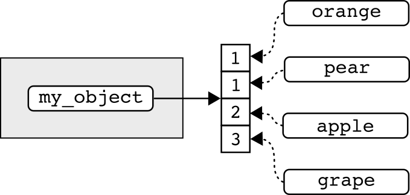
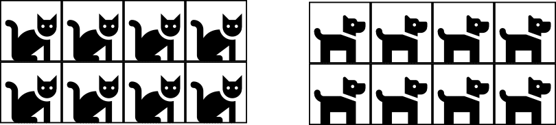
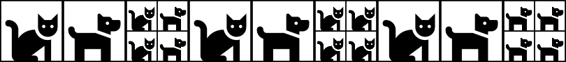
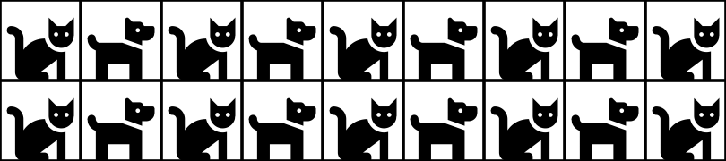

<head>
<meta 
name="viewport" 
content=
"width=100vw, 
initial-scale=1,
maximum-scale=1" />
<link 
rel="stylesheet"  
href="https://cdnjs.cloudflare.com/ajax/libs/font-awesome/4.7.0/css/font-awesome.min.css">
<link rel="shortcut icon" href="images/data_sci_hex_logo.png" />
</head>

```{r setup, include=FALSE}
# Load libraries:

library(learnr)
library(tidyverse)

knitr::opts_chunk$set(
  echo = TRUE,
  tidy.opts = 
    list(
      width.cutoff = 60),
  tidy = TRUE)

tutorial_options(exercise.completion = FALSE)

# Objects used:

my_object <-
  c(1, 1, 2, 3)

bunnies <- 
  c(1, 1, 2, 3, 5, 8)

my_matrix <-
  matrix(
    my_object,
    ncol = 2,
    dimnames = 
      list(
        c("a", "b"),
        c("x", "y")))

my_list <-
  list(
    my_object,
    my_matrix)

my_data_frame <-
  data.frame(
    words = 
      c('hello',
        'hello',
        'world' ,
        'world'),
    integers = 1:4)

musicians <-
  c("roger",
    "pete",
    "john",
    "keith")

role <-
  c("vocals",
    "guitar",
    "bass",
    "drums")

my_tibble <- 
  tibble(musicians, role)
```

## Overview

::: {.row}

Objects are containers that hold instructions for code execution, functions, values, or other objects. Recall that *everything that exists in R is an object* (John Chambers). Data within objects may be structured in different ways and these differences define when and how we work with them. 

In this lesson we'll address what I will call "data objects", which I define here as containers used to organize values within an environment. We will cover:

* The most common data objects -- atomic vectors, matrices, lists, and data frames. 
* Naming conventions for objects
* Managing objects in your global environment
* Reading and writing data objects
:::

<hr style="border-width: 5px;">

## 1. Types of objects

Data objects can be defined by the number of dimensions and classes of values (e.g., integers or decimal numbers) that they contain.

:::{style="width: 40%; margin-left: 0px"}
|  Dimensions  |  Homogeneous  |  Heterogeneous  | 
|:------------:|:-------------:|:---------------:|
| 1-D          | Atomic vector | List            |
| 2-D          | Matrix        | Data frame      |
:::

**Dimensions** describe the arrangement of values within an object:

* **One-dimensional** objects are also known as **vectors** and data are arranged in a single line. 
* Data in **two-dimensional** objects are arranged as rows and columns.

**Homogeneity** describes whether the object may contain one or more than one class of object:

* **Homogeneous** objects may only contain a single class of data. 
* **Heterogeneous** objects may contain more than one class of data.

*Note: Recall that the **class** of a data object pertains to the kind of values represented (e.g., numbers, characters, factors, and logicals).*

<hr style="border-width: 5px;">

## 2. Atomic vectors

An **atomic vector** is a **one-dimensional** collection of values (but recall that a single value is, by default, also an atomic vector). Values in an atomic vector are homogeneous -- all values must be of the same class. 

<figure style="margin-bottom: 1em; text-align: left;">

</figure>

We've already learned how to create an atomic vector -- this is the type of object that we created using the combine function, `c()`:

```{r}
my_object <- 
  c(1, 1, 2, 3)
```

### 2.1 The structure of atomic vectors

The **structure** of an object describes the class of object, an object's dimensions, how the data are stored, and metadata that describe the object. In the previous lesson we used `class()` and `typeof()` to observe an object's class and type. 

::: {.now_you}
<i class="fa fa-user-circle"></i>
Determine the class and type of the atomic vector `my_object`.

```{r classType_avec, exercise = TRUE, exercise.lines = 5}


```

```{r classType_avec-hint-1}
class(...)

typeof(...)
```

```{r classType_avec-hint-2}
class(my_object)

typeof(my_object)
```
:::

We can use `length()` to determine the number of values that make up the atomic vector:

```{r}
length(my_object)
```

#### 2.1.1 Attributes of atomic vectors

The **attributes** of an object provides information about the values (i.e., metadata) not contained in the values themselves. You can print the attributes of an object using the function `attributes()`:

```{r}
attributes(my_object)
```

As we can see, atomic vectors do not have any attributes by default -- we have to add them. For example, values in a vector may contain a "names" attribute. We can assign names to the components of an object using the `names` function.

The argument of `names()` is the name of the parent object (which, in this case, is an atomic vector). We then use the `<-` operator and providing a character vector of names:

```{r}
names(my_object) <-
  c("orange",
    "pear",
    "apple",
    "grape")
```

Conversely, we can also add names during the creation of an atomic vector using the assignment operator `=`:

```{r}
my_object <- 
  c(orange = 1,
    pear = 1,
    apple = 2,
    grape = 3)
```

To view the names assigned to each value we can use `names()` to print the names attribute:

```{r}
names(my_object)
```

... view the names with `attributes()`:

```{r}
attributes(my_object)
```

... or view the names just by printing the object itself:

```{r}
my_object
```

::: {.secret-div}
[<i class="fa fa-user-secret"></i>
What's in a name?]{style="font-size: 1.25em"}

We've previously addressed assignment as it relates to the global environment. Names assigned to the global environment (e.g., `my_object`) and those assigned to the "children" of "parent" objects (e.g., "apple" assigned to the value 2 in `my_object`) are very different!

When we assign a name to the global environment, R can access the data directly with the assigned name:

```{r}
my_object
```

When we assign names to the children of a parent object, the assigned names are an attribute of the object -- they don't live in the global environment!

```{r, error = TRUE}
apple
```

We might visualize this as:



In the above, we see that neither the data nor the names assigned to the individual values live in the global environment (the gray box) -- the global environment contains only the name `my_object`. We'll learn how to use the names associated with child objects in our next preliminary lesson.
:::

<hr>

We can remove the `names` attribute from an integer vector by setting the attribute to `NULL`:

```{r}
names(my_object) <- NULL

attributes(my_object)

```

The above might seem a little strange. Why can't you write `NULL <- names(my_object)`? It's because NULL is actually a value (a list of length zero) whereas the names of `my_object` represents an assignment.

Unlike removing a name assigned to an environment, the data associated with the object are maintained:

```{r}
my_object
```

### 2.3 Exercise

::: {.now_you}
[<i class="fa fa-user-circle"></i>
Test your atomic vector skills ... let's form a rock band!]{style="font-size: 1.25em"}

Without assigning a name to your global environment, generate a character vector with the values "vocals", "guitar", "bass", and "drums".

```{r band, exercise = TRUE, exercise.lines = 4}

```

```{r band-solution}
c("vocals",
  "guitar",
  "bass",
  "drums")
```

Repeat the above, using the `=` operator to assign band members to their instruments. Assign roger to vocals, pete to guitar, john to bass, and keith to drums.

```{r band_members, exercise = TRUE, exercise.lines = 4}

```

```{r band_members-solution}
c(roger = "vocals",
  pete = "guitar",
  john = "bass",
  keith = "drums")
```

Repeat the above and print the attributes of the resultant object:

```{r band_attributes, exercise = TRUE, exercise.lines = 4}

```

```{r band_attributes-solution}
attributes(
  c(roger = "vocals",
    pete = "guitar",
    john = "bass",
    keith = "drums"))
```
:::

<hr style="border-width: 5px;">

## 3. Matrix objects

A **matrix** is an atomic vector that has been arranged into rows and columns (i.e., matrices are two-dimensional). Because the data in a matrix *is* an atomic vector, all matrices must be homogeneous.

<figure style="margin-bottom: 1em; text-align: left;">

</figure>

### 3.1 Constructing a matrix

You can use the function `matrix()` to create a matrix. This function contains the following arguments:

* `x = {atomic vector}`: The atomic vector you would like to convert to a matrix
* `nrow = {number}`: The number of rows in the matrix (optional).
* `ncol = {number}`: The number of columns in the matrix (optional). 
* `byrow = {logical}`: Whether the matrix is filled by column (FALSE, the default) or row (TRUE)

Let's start with the default options and convert `my_object` to a matrix (*Note: this is the same `my_object` that you worked with above*):

```{r}
matrix(my_object)
```

This converted `my_object` to a two-dimensional object, a table with four rows and one column. The data are arranged in a single column.

If we want to change the dimensional structure of the data (i.e., number of rows or columns) we can explicitly set the number of rows or columns:

```{r}
matrix(
  my_object,
  nrow = 1)
```

By explicitly setting the number of rows to 1, the number of columns used to express the data was increased to 4. We could have also rearranged the data as such by setting the number columns to 4:

```{r}
matrix(
  my_object,
  ncol = 4)
```

This makes `matrix()` a pretty smart function (you only need to set the number of rows *or* columns)!

There is rarely a need for a matrix with just a single column or row (atomic vectors are much easier to use)! Let's see what happens if we set the number of rows to 2:

```{r}
matrix(
  my_object,
  ncol = 2)
```

This restructured the dimensions of the data to a 2 x 2 square -- the number of rows was determined by the number of columns in the `ncol` argument.

Notice the order of the values. They are filled column-wise by default -- from top-to-bottom. To understand how this works, watch what happens when we specify `byrow = TRUE`:

```{r}
matrix(
  my_object,
  ncol = 2,
  byrow = TRUE)
```

In the above, `matrix(..., byrow = TRUE)` filled in the values from left-to-right.

::: {.secret-div}
[<i class="fa fa-user-secret"></i>
Know your data!]{style="font-size: 1.25em;"}

When building a matrix, it's super important to have a good sense of the data going in. For example, notice what happens when we generate a 4-column matrix with an atomic vector that contains only three values:
```{r}
matrix(
  c('hello',
    'world',
    'howdy'),
  ncol = 4)
```

We can see that `matrix()` recycled the first value in the set! Thankfully, R also provided us with a warning message (<i class="fa fa-user-secret"></i> Always pay attention to warning messages!).
:::

### 3.2 The structure of matrices

#### 3.2.1 Matrix dimensions

We can evaluate the dimensional structure of the data using the functions `nrow` and `ncol`, which represent the number of rows and columns, respectively:

```{r}
nrow(
  matrix(my_object))

ncol(
  matrix(my_object))
```

The function `dim` will return the number of rows *and* columns:

```{r}
dim(
  matrix(my_object))
```

This returned an integer vector with two values, where the first value is the number of rows and the second value is the number of columns.

We can use `length()` to determine the number of values in the matrix:

```{r}
length(
  matrix(my_object))
```

#### 3.2.2 Matrix class and type

Recall that when we use the `class()` function, the class of object is returned:

```{r}
class(
  matrix(my_object))
```

Here we see that the object is *both* a matrix and an array. An **array** is a more general term -- it describes an atomic vector with an additional attribute (`dim`) that provides the dimensions (thus a matrix is a two-dimensional array). This highlights what a matrix is -- it is an atomic vector with attributes describing the dimensions of the object.

```{r}
attributes(
  matrix(my_object))
```

Because a matrix *is* an atomic vector, the function `typeof` shows us how the values are stored in our computer:

```{r}
typeof(
  matrix(my_object))
```

::: {.secret-div}
[<i class="fa fa-user-secret"></i>
Don't forget that matrices are homogeneous!]{style="font-size: 1.25em"}

Because matrices <i>secretly</i> are atomic vectors all values in a matrix must be of the same type. If they are not, they are coerced into characters (the most general of classes):

```{r}
matrix(
  c(1, "one", 2, 3))
```

The above is still a matrix, and therefore homogeneous, but the number values (`1`, `2`, and `3`) have been coerced into characters!
:::

#### 3.2.3 Row and column names of a matrix

We've seen that matrices have one attribute by default -- the dimensions of the matrix. Additional attributes, such as row and column names, can be added during matrix construction.

Let's generate a simple two-column matrix:

```{r}
matrix(
  my_object,
  ncol = 2)
```

We can assign names to rows after a matrix has been assigned with the `row.names` function:

```{r}
my_matrix <-
  matrix(
    my_object,
    ncol = 2)

row.names(my_matrix) <-
  c("a", "b")

my_matrix
```

... and assign column names with the `colnames` function:

```{r}
colnames(my_matrix) <-
  c("x", "y")

my_matrix
```

::: {.secret-div}
[<i class="fa fa-user-secret"></i>
Attributes are metadata!]{style="font-size: 1.25em"}

The row and column names that we added above haven't altered the data, they've altered attributes that describe the data!

```{r}
attributes(my_matrix)
```
:::

### 3.3 Exercise

::: {.now_you}
[<i class="fa fa-user-circle"></i>
Test your matrix skills!]{style="font-size: 1.25em"}

The object `bunnies` is assigned to a numeric vector:

```{r}
bunnies <- 
  c(1, 1, 2, 3, 5, 8)
```

Convert `bunnies` to a two-column matrix where the values are filled by row, save the object to memory by assigning the name `bunny_matrix` to global environment, and assign the names "hello" and "world" to the columns of the matrix (*Note: To ensure that your code worked, call `bunny_matrix` after completing this problem*):

```{r bunnies_mat, exercise = TRUE, exercise.lines = 8}

```

```{r bunnies_mat-hint-1}
bunny_matrix <-
  ```

```{r bunnies_mat-hint-2}
bunny_matrix <-
  matrix(bunnies)
```

```{r bunnies_mat-hint-3}
bunny_matrix <-
  matrix(
    bunnies,
    ncol = 2)
```

```{r bunnies_mat-hint-4}
bunny_matrix <-
  matrix(
    bunnies,
    ncol = 2,
    byrow = TRUE)
```

```{r bunnies_mat-hint-5}
bunny_matrix <-
  matrix(
    bunnies,
    ncol = 2,
    byrow = TRUE)

colnames(bunny_matrix) <-
  c("hello", "world")
```

```{r bunnies_mat-hint-6}
bunny_matrix <-
  matrix(
    bunnies,
    ncol = 2,
    byrow = TRUE)

colnames(bunny_matrix) <-
  c("hello", "world")

bunny_matrix
```
:::

<hr style="border-width: 5px;">

## 4. List objects

A **list** is a one-dimensional object constructed by combining ANY objects with ANY dimensionality. Because of their flexibility, lists can be very powerful (and often challenging!). 

<figure style="margin-bottom: 1em; text-align: left;">

</figure>

### 4.1 Constructing a list

A list is created using `list()`. The arguments of the `list` function are the items contained within the list. We can generate lists that contain:

A homogeneous list of values:

```{r}
list(1, 1, 2, 3)
```

A heterogeneous list of values:

```{r}
list(1, 'one', 2)
```

A list of multidimensional objects:

```{r}
list(my_object, my_matrix)
```

As with all objects, we can access the data in the future if we assign a name to the list:

```{r}
my_list <-
  list(
    vector = my_object,
    matrix = my_matrix)
```

### 4.2 The structure of lists

Lists are vectors -- just heterogeneous ones. We can view the structure of list objects in a similar way to atomic vectors.

The class of a list and how the data are stored are both "list":

```{r}
class(my_list)

typeof(my_list)
```

The function `length` can be used to return the number of list objects:

```{r}
length(my_list)
```

Notice in the above that this returns the number of list items, not the number of values. For example, the list items of `my_list` are the objects `my_object` and `my_matrix`. Each object is comprised of four values. There's currently 8 values in the list but the values are stored within two separate list items.

#### 4.2.1 Assigning names

Like atomic vectors, a list has no attributes by default:

```{r}
attributes(
  list(my_object, my_matrix))
```

When we create a list, we can assign name attributes to the component objects using the `=` operator:

```{r}
list(
  vector = my_object,
  matrix = my_matrix)
```

With our list assigned to the global environment, we can assign names using the function `names`:

```{r}
names(my_list) <- 
  c("vector", "matrix")
```

... or use `names()` to print the names assigned to each component object:

```{r}
names(my_list)
```

### 4.3 List application: Object attibutes

#### 4.3.1 Adding names to a matrix

Lists are often used to inform functions. For example, the matrix function contains an optional `dimnames =` argument (the default is `NULL`). We supply the names in a list where the first list item is a character vector of row names and the second list item is a character vector of column names:

```{r}
matrix(
  my_object,
  ncol = 2,
  dimnames = 
    list(
      c("a", "b"),
      c("x", "y")))
```

If we wanted column names but no row names, we can set the row names to `NULL`:

```{r}
matrix(
  my_object,
  ncol = 2,
  dimnames = 
    list(
      NULL,
      c("x", "y")))
```

Likewise, if we wanted row names and no column names, we can set the column names to `NULL`:

```{r}
matrix(
  my_object,
  ncol = 2,
  dimnames = 
    list(
      c("a", "b"),
      NULL))
```

:::{.secret-div}
[<i class="fa fa-user-secret"></i>
Avoid unnecessary functions!]{style="font-size: 1.25em"}

Defining the matrix names with a list is my preferred method. If we are aware of the arguments in the `matrix` function, using `row.names()` or `colnames()` after a matrix has been created is rarely necessary. Moreover, bringing in a new function into our code requires us to:

1. Find out the function exists (which can sometimes be challenging!)
2. Read the help documentation for the function to find out how to use it

My coding philosophy is that, for a given task, we should strive to code with as few functions as possible. Understanding the functions that we're using helps us achieve this goal. 

<i class="fa fa-user-secret"></i> Read the documentation (`?function`) for every function you use!


:::

#### 4.3.2 Adding attributes to an existing matrix

We have thus far used `attributes()` to view the attributes of an object:

```{r}
attributes(my_matrix)
```

We've seen the above before, but what sort of object is this?

```{r}
class(
  attributes(my_matrix))
```

The attributes themselves are a list! 

We can also use `attributes()` to assign attributes to an object. This is a very powerful and flexible method for adding informative metadata to an object!

```{r}
attributes(my_matrix) <- 
  list(
    colnames = c('hello','world'),
    author = 'Brian',
    reason = 'To show attribute lists')

attributes(my_matrix)
```

### 4.4 Exercise

::: {.now_you}
[<i class="fa fa-user-circle"></i>
Test your list skills!]{style="font-size: 1.25em"}

Recall that we generated an atomic vector and assigned the name `my_object` to the data:

```{r}
my_object <- 
  c(1, 1, 2, 3)
```

Use the `attributes` function and `list()` to assign the names "orange", "pear", "apple", and "grape" to the values in `my_object` (*Note: To ensure that your code worked, call `my_object` after completing this problem*):

```{r attibutes_my_object, exercise = TRUE, exercise.lines = 8}

```

```{r attibutes_my_object-hint-1}
attributes(my_object)
```

```{r attibutes_my_object-hint-2}
attributes(my_object) <-
  list()
```

```{r attibutes_my_object-hint-3}
attributes(my_object) <-
  list(
    names = )
```

```{r attibutes_my_object-hint-4}
attributes(my_object) <-
  list(
    names = 
      c())
```

```{r attibutes_my_object-hint-5}
attributes(my_object) <-
  list(
    names = 
      c("orange",
        "pear",
        "apple",
        "grape"))
```

```{r attibutes_my_object-hint-6}
attributes(my_object) <-
  list(
    names = 
      c("orange",
        "pear",
        "apple",
        "grape"))

my_object
```
:::

<hr style="border-width: 5px;">

## 5. Data frames

A **data frame** is the object class that is most often used for storing data. Like a matrix, a data frame has two dimensions with data arranged into rows and columns. This is where the similarity between data frames and matrices ends -- a data frame is a heterogeneous data structure that is actually a restrictive type of list. 

<figure style="margin-bottom: 1em; text-align: left;">

</figure>

### 5.1 Constructing a data frame

Data frames are created by assembling list items into columns where:

* The length of each list item is equal;
* Each list item is a vector (*almost* always an atomic vector)

One method for arranging values into data frames is to use the `data.frame()` function. The arguments of this function are the vectors that make up the object (`data.frame({vector_1}, {vector_2})`):

```{r}
data.frame(
  c("hello",
    "hello",
    "world", 
    "world"),
  1:4)
```

This created a data frame successfully, though the names are a bit of a mess. Because of that, let's head straight to the "attributes" section ...

### 5.2 The attributes of a data frame

As we have with the other objects, we can use `attibutes()` to see important metadata about the object:

```{r}
attributes(
  data.frame(
    c("hello",
      "hello",
      "world", 
      "world"),
    1:4))
```

Here, we see that there are three sets of attributes associated with a data frame upon creation:

* A vector of names (albeit terrible ones)
* The class of the object
* A vector of row names

Why does `attributes()` return the class of a data frame? That's because a data frame *is* a list where the list items are arranged as columns -- this structure applied to the data is defined by the object's class.

We can verify this by looking at how the data are stored:

```{r}
typeof(
  data.frame(
    c("hello",
      "hello",
      "world", 
      "world"),
    1:4))
```

We get another clue into the true nature of a data frame as we start digging into the dimensions. First, let's look at the dimensions of the object:

```{r}
dim(
  data.frame(
    c("hello",
      "hello",
      "world", 
      "world"),
    1:4))
```

This returned an integer vector and the results are what we may have expected -- the data are arranged into four rows (the first value) and two columns (the second value). But watch what happens when we ask the `length` of the object:

```{r}
length(
  data.frame(
    c("hello",
      "hello",
      "world", 
      "world"),
    1:4))
```

Perhaps surprisingly, we see that the length of the data frame is 2! This value represents the number of list items in the data frame. Not to beleaguer the point but ... a data frame is a list!

*Note: Like matrices, you can also use* `nrow()` *and* `ncol()` *to explore a data frame's dimensions.*

#### 5.2.1 Assigning names to a data frame

Finally! We can assign names to the list items that comprise a data frame during the construction of the object:

```{r}
data.frame(
  greetings = 
    c("hello",
      "hello",
      "world", 
      "world"),
  numbers = 1:4)
```

If a name for our data frame has been assigned to the global environment, we can use `names()` to assign names to the list items:

```{r}
my_data_frame <- 
  data.frame(
    c("hello",
      "hello",
      "world", 
      "world"),
    1:4)

names(my_data_frame) <-
  c("hello", "world")

my_data_frame
```

Why do we not have to specify column names? Because a data frame is a list and each column is a list item, `names()` is associated with the columns of the object.

Similar to matrices, we can also assign names to the rows:

```{r}
row.names(my_data_frame) <-
  c("a", "b", "c", "d")

my_data_frame
```

*I would caution against the above, however ... though there's rarely a need for naming rows!*

We can assign names to columns and rows using `attributes`:

```{r}
attributes(my_data_frame) <- 
  list(
    names = c("hello", "world"),
    row.names = c("a", "b", "c", "d"))

my_data_frame
```

**Note**: If names are already assigned to component vectors, the columns of the data frame will use the assigned names by default:

```{r}
boy <- 1:4
howdy <- 5:8

data.frame(boy, howdy)
```

### 5.3 The tibble: A very special data frame

If we have the tidyverse loaded onto our computers, we have access to a special kind of data frame called a **tibble**. The construction of a tibble is largely equivalent to that of a data frame (except we use the `tibble` function):

```{r}
my_tibble <- 
  tibble(
    greetings = 
      c("hello",
        "hello",
        "world", 
        "world"),
    numbers = 1:4)
```

The magic of a tibble (or at least *part* of the magic of a tibble) is the output that is printed:

```{r}
my_tibble
```

In the above we can see the dimensions of the data frame (`a tibble: 4 x 2`), the class of values associated with each of the columns, and the data!

As useful as tibbles are, some functions require traditional data frames as an input. To address this we can use the `data.frame` function:

```{r}
data.frame(my_tibble)
```

Likewise, we can use `tibble()` to convert a traditional data frame to a tibble:

```{r}
tibble(my_data_frame)
```

::: {.secret-div}
[<i class="fa fa-user-secret"></i>
Use tibbles!]{style="font-size: 1.25em"}

Because tibbles are so informative, I almost never use traditional data frames. I highly recommend making the tibble your default data frame.
:::

### 5.4 Exercise

::: {.now_you}
[<i class="fa fa-user-circle"></i>
A rock band data frame!]{style="font-size: 1.25em"}

Our rock band can be defined by the musicians and the instruments that they play:

```{r}
musicians <-
  c("roger",
    "pete",
    "john",
    "keith")

role <-
  c("vocals",
    "guitar",
    "bass",
    "drums")
```

Use `tibble()` to combine generate a two-column data frame where the first column is the musician and the second column is their role in the band:

```{r the_who_df, exercise = TRUE, exercise.lines = 5}

```

```{r the_who_df-solution}
tibble(musicians, role)
```
:::

<hr style="border-width: 5px;">

## 6. Read & write objects

As a final step in our objects lesson, let's look at how we might read objects into R and save objects to our hard disk. For these tasks, I do not use base R functions. Instead, I primarily use the `readr` package, which is a part of the `tidyverse` metapackage.

To use `readr`, we must start by loading the `tidyverse` library in our current session:

```{r}
library(tidyverse)
```

### 6.1 Read and write atomic vectors

To read in an atomic vector we use `read_lines()` and supply the path to the file inside of the parentheses (*Note: This is an example only. You have not been given `my_object.txt` and the file path in the example is specific to my own folder structure.*):

```{r, eval = FALSE}
read_lines("intro_material/data/my_object.txt")
```

To use the object, we need to assign a name to the object in our global environment:

```{r, eval = FALSE}
my_object <- 
  read_lines("intro_material/data/my_object.txt")
```

This produces an atomic vector:

```{r}
my_object
```

To write an atomic vector to your hard disk, use `write_lines()`. Here you supply the atomic vector and the path to the file:

```{r, eval = FALSE}
write_lines(
  c(1, 1, 2, 3),
  "intro_material/data/my_object.txt")
```

... or the name assigned to the atomic vector and the path to the file:

```{r, eval = FALSE}
write_lines(
  my_object,
  "intro_material/data/my_object.txt")
```

### 6.2 Read and write tabular data

To read in tabular data, we use `read_csv()` and supply the path to the file inside of the parentheses:

```{r, eval = FALSE}
my_tibble <-
  read_csv("intro_material/data/my_tibble.csv")
```

This produces a tibble:

```{r}
my_tibble
```

**Note**: "csv" stands for comma separated values. This is the preferred method for storing spreadsheet data because it is not platform-specific. When using Microsoft Excel, you can create a *csv* file by using the "Save as ..." option.

To write a data frame to your hard disk, use `write_csv()`. Here you supply the data frame and the path to the file:

```{r, eval = FALSE}
write_csv(
  tibble(musicians, role),
  "intro_material/data/my_tibble.csv")
```

... or the name assigned to the data frame and the path to the file:

```{r, eval = FALSE}
write_csv(
  my_tibble,
  "intro_material/data/my_tibble.csv")
```

### 6.3 Read and write R objects

One of my favorite ways for reading and writing data is with rds files. I'm not quite sure what "rds" stands for (I've found a few different definitions -- "R dataset", "R data serialized", and "R data singular"). Regardless of what those initials mean, rds files are incredibly useful because the class and type of the object and the object's attributes are maintained.

We can read in any class of object using `read_rds()` by supplying the path to the file inside of the parentheses.

Read in an atomic vector:

```{r, eval = FALSE}
my_object <-
  read_rds("intro_material/data/my_object.rds")
```

Read in a tibble:

```{r, eval = FALSE}
my_tibble <-
  read_rds("intro_material/data/my_tibble.rds")
```

Of course, you have to save an rds file to your hard disk before you can use them. You can do so with the function `write_rds()`. Here you supply the object and the path to the file:

```{r, eval = FALSE}
write_rds(
  tibble(musicians, role),
  "intro_material/data/my_tibble.rds")
```

... or the name assigned to the data frame and the path to the file:

```{r, eval = FALSE}
write_rds(
  my_tibble,
  "intro_material/data/my_tibble.rds")
```

**Note**: A disadvantage of rds files is that they can only be used in R. That's not a problem if you have an all-R workflow, but might be an issue if your working across multiple programs (e.g., Microsoft Excel and R) or collaborating with people who are not R users.

<hr style="border-width: 5px;">

## 7. Term review and glossary

::: {.glossary}

### R functions

* `<-` Assign a name to an object in R (assignment operator)
* `=` Define internal assignments
* `()` Enclose arguments in a function
* `?` Access help documentation for a given function
* `:` Specify a range of number values with `from:to`
* `attributes` Print or set the attributes of an object (e.g., names)
* `c` Combine objects
* `class` Determine the class of an object
* `colnames` Add column names to a matrix or print assigned names
* `data.frame` Arrange equal length vectors into a data frame
* `dim` Print the dimensions of a two-dimensional object
* `length` Determine the length of an object -- for atomic vectors and matrices, this returns the number of values; for lists and data frames, this returns the number of component objects
* `library` Add a package to a user's current R session
* `list` Structure component objects into a list
* `matrix` Arrange an atomic vector as a matrix
* `names` Assign names to the children of a parent object or print assigned names
* `ncol` Print the number of columns in a data frame or matrix
* `nrow` Print the number of rows in a data frame or matrix
* `read_csv` Read in comma-separate tabular data from your hard disk to associate the object with your current session
* `read_lines` Read in atomic vectors from your hard disk to associate the object with your current session
* `read_rds` Read in rds files from your hard disk to associate the object with your current session
* `row.names` Assign row names to a matrix or data frame or print assigned names
* `tibble` Create a tibble data frame
* `typeof` Determine how R stores an object in your global environment
* `write_csv` Write a data frame to your hard disk as comma-separated values
* `write_lines` Write an atomic vector to your hard disk as a text file
* `write_rds` Write any R object to your hard disk as an rds file

### Vocabulary

* **Atomic vector**: A set of values of the same class (<i>homogeneous</i>) arranged in one dimension
* **Attributes**: Information about the values of an object that is not contained in the values themselves
* **Data frame**: A special type of list that is comprised of equal-length vectors; data frames are <i>heterogeneous</i> and have two dimensions.
* **Dimensions**: The arrangement of values in an object; may also refer to the number of values or child objects within a given dimension (i.e., rows or columns)
* **Heterogeneous object**: A container that holds values of one or more object classes
* **Homogeneity**: Whether an object may contain one or more than one class of object
* **Homogeneous object**: a container that holds values of only one class
* **Indexing**: Subsetting an object by the location of a value or values within an object
* **List**: A storage container that holds objects of any class; lists are <i>heterogenous</i> and have one dimension
* **Matrix**: An atomic vector that is arranged into rows and columns. Matrices are <i>homogeneous</i> and have two dimensions.
* **One-dimensional object**: Objects where data are arranged in a single line
* **Structure**: The class of data, how the data are stored, dimensions, and metadata describing the object
* **Tibble**: A type of data frame with unique properties that make them super useful!
* **Two-dimensional object**: An object where data are arranged as rows and columns
* **Vector**: A one-dimensional object
:::

<hr style="border-width: 5px;">
