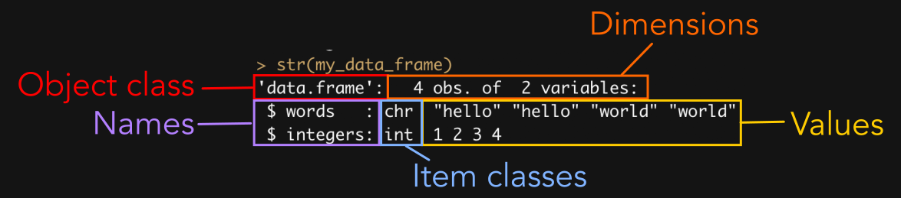
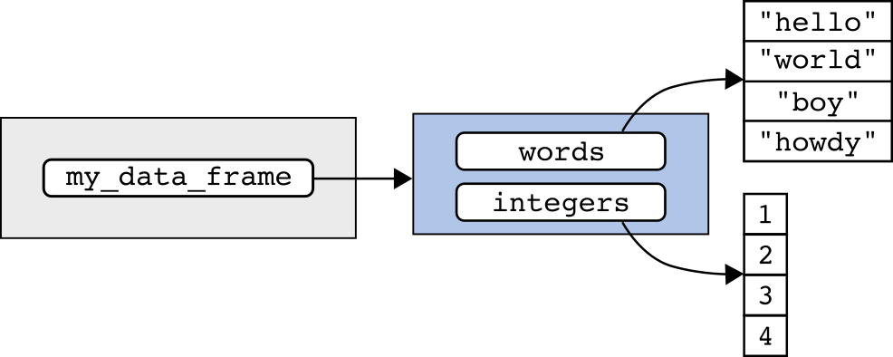
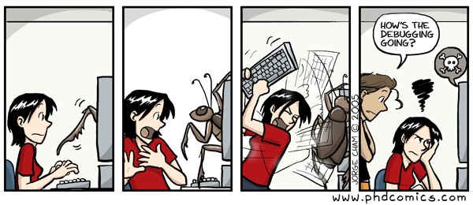

<head>
<meta 
name="viewport" 
content=
"width=100vw, 
initial-scale=1,
maximum-scale=1" />
<link 
rel="stylesheet"  
href="https://cdnjs.cloudflare.com/ajax/libs/font-awesome/4.7.0/css/font-awesome.min.css">
<link rel="shortcut icon" href="images/data_sci_hex_logo.png" />
</head>

```{r setup, include=FALSE}
# Load libraries:

library(learnr)
library(tidyverse)

knitr::opts_chunk$set(
  echo = TRUE,
  tidy.opts = 
    list(
      width.cutoff = 60),
  tidy = TRUE)

# Objects used:

my_object <-
  c(1, 1, 2, 3)

my_matrix <-
  matrix(
    my_object,
    ncol = 2,
    dimnames = 
      list(
        c("a", "b"),
        c("x", "y")))

my_list <-
  list(
    my_object,
    my_matrix)

my_data_frame <-
  data.frame(
    words = 
      c('hello',
        'hello',
        'world' ,
        'world'),
    integers = 1:4)

musicians <-
  c("roger",
    "pete",
    "john",
    "keith")

role <-
  c("vocals",
    "guitar",
    "bass",
    "drums")

my_tibble <- 
  tibble(musicians, role)
```

## Overview


A data object in R may contain one or multiple values. Depending on the type of object, these values may be atomic (as all values in matrices and atomic vectors must be) or may themselves be stored in more complex data objects (e.g., lists). When using or managing data, we often need to reduce a data object to just the component or components of interest. This process is known as **subsetting**.

A key trait of data objects is that their components are ordered -- in other words each of an object's components (e.g., values in an atomic vector) occupies a position within the object. In this lesson, we'll look at the foundational method of subsetting -- **indexing**. Indexing describes the process of subsetting an object by the position of a component of interest.

<hr style="border-width: 5px;">

## 1. Positions in an object

Before we can subset an object using indexing, it's important to consider how the indices of an object are structured. 

### 1.1 Atomic vectors

An atomic vector is a one-dimensional object where each value in the vector has a position. The position of a value in an object is known as its **index**. In an atomic vector, this may be denoted as `[i]`.

Let's take a look at the object that we assigned to the name `my_object`:

```{r}
my_object
```

The values and indices of `my_object` could be summarized as:

::: {style="width: 50%;"}
|  index     |  notation |  value  | 
|:----------:|:---------:|:-------:|
| 1          | [1]       | 1       |
| 2          | [2]       | 1       |
| 3          | [3]       | 2       |
| 4          | [4]       | 3       |
:::

This would more succinctly yield the following table of indices and their associated values:

::: {style="width: 50%;"}
|  [1]  |  [2] |  [3]  |  [4]  |
|:-----:|:----:|:-----:|:-----:|
| 1     | 1    | 2     |   3   |
:::

### 1.2 Matrices

Recall that a matrix object is an atomic vector with a `dim` attribute that arranges the data as rows and columns. Values in a matrix have a row (`i`) and column (`j`) position, denoted by `[i, j]`. It may be useful for you to think of a value's position as `[row, column]`.

Let's take a look at the object that we assigned to the name `my_matrix`:

```{r}
my_matrix
```

This matrix could be visualized as:

::: {style="width: 50%;"}
|          |  [, 1] | [, 2] |
|:--------:|:------:|:-----:|
| **[1, ]** |    1   |   2   |
| **[2, ]** |    1   |   3   |
:::

::: {.secret-div}
[<i class="fa fa-user-secret"></i>
Of course, a matrix is still an atomic vector!]{style="font-size: 1.25em"}

Because a matrix *is* an atomic vector, each position in the vector may also be described by `[i]`.
:::

### 1.3 Lists

A list is a vector where each item in the list can be an object of any class. List items are denoted by the notation `[[i]]`.

Let's look at the object that we assigned to the name `my_list`:

```{r}
my_list
```

The object `my_list` could also be visualized as:

<div class = "flex-container" 
style="flex-direction: row; flex-wrap: wrap; justify-content: flex-start;">

<div style="display: flex;">
**[[1]]**
<div style="width: 40%; margin-left: 15px;">
|  [1]  |  [2] |  [3]  |  [4]  |
|:-----:|:----:|:-----:|:-----:|
| 1     | 1    | 2     |   3   |
</div>
</div>

<div style="display: flex;">
**[[2]]**
<div style="width: 40%; margin-left: 15px;">
|          |  [, 1] | [, 2] |
|:--------:|:------:|:-----:|
| **[1, ]** |    1   |   2   |
| **[2, ]** |    1   |   3   |
</div>
</div>
</div>

### 1.4 Data frames

Data frames are lists arranged into rows and columns. Each column represents a list item and each list item must be of the same length. Like matrices, values in a data frame have a row (`i`) and column (`j`) position, denoted by `[i, j]` (i.e., `[row, column]`).

Let's look at the object that we assigned to the name `my_data_frame`:

```{r}
my_data_frame
```

Because a data frame is two-dimensional (rows and columns), we might visualize `my_data_frame` as:

::: {style="width: 50%;"}
|          | [,1]     | [,2]     |
|:--------:|:--------:|:--------:|
| **[1, ]** | "hello"  | 1        |
| **[2, ]** | "hello"  | 2        |
| **[3, ]** | "world"  | 3        |
| **[4, ]** | "world"  | 4        |
:::

<hr style="border-width: 5px;">

## 2. Indexing data by position

Square brackets (`[]` and `[[]]`) are operator functions that are used to extract part of an object. 

### 2.1 Extract individual values or list items

We use the double square brackets operator (`[[]]`) to extract a single value or list item from a parent object.

#### 2.1.1 One-dimensional objects

Recall the structure of `my_object`:

```{r}
my_object
```

::: {style="width: 50%;"}
|  [1]  |  [2] |  [3]  |  [4]  |
|:-----:|:----:|:-----:|:-----:|
| 1     | 1    | 2     |   3   |
:::

To extract the value at position `i` of `my_object` we provide:

1. The name of the object
2. An opening double-square bracket, `[[`
3. The index of the value, `i`
4. A closing double-square bracket `]]`

For example, to extract the value at position 3, we would write:

```{r}
my_object[[3]]
```

In plain English, you would read the above as "`my_object` *at* position 3" or "`my_object` *where* the position is three".

The above also works for list objects. 

```{r}
my_list
```

To extract the list item at position 2 of `my_list`:

```{r}
my_list[[2]]
```

*Note: Square bracket operators include both the opening and closing brackets. In other words, the code * `my_list[[2]]` *contains a single function,* `[[]]`.

#### 2.1.2 Two-dimensional objects

For two-dimensional objects (matrices and data frames), we can use the row and column position of the value. To do so, we provide:

1. The name of the object
2. An opening extraction operator, `[[`
3. The index of the row position, `i`
4. A comma (optimally followed by a space for readability)
5. The index of the column position, `j`
6. A closing extraction operator `]]`

Let's use `my_matrix` as an example:

```{r}
my_matrix
```

To extract the value at the first row and second column of `my_matrix` we would conduct the following operation:

```{r}
my_matrix[[1, 2]]
```

Likewise, to extract the value in the first row and second column of `my_data_frame`:

```{r}
my_data_frame

my_data_frame[[1, 2]]
```

Because *matrices are atomic vectors* (just with an additional `dim` attribute), we can also extract a value by its position in the vector:

```{r}
my_matrix[[4]]
```

Because *data frames are a type of list*, we can extract an individual list item in the same manner as any other list:

```{r}
my_data_frame[[2]]
```

::: {.secret-div}
[<i class="fa fa-user-secret"></i>
Use double-brackets for extracting individual items!]{style="font-size: 1.25em"}

There are many instances in which single bracket operators (e.g., `[i]` or `[i, j]`) can be used to extract individual values. Because this is not universally the case, it's considered best practice to always use double-square bracket (e.g., `[[i]]` or `[[i, j]]`) operators when indexing to a single position. 
:::

### 2.2 Extract multiple values or list items

We use single square brackets (`[]`) to extract a multiple values or list items from a parent object.

#### 2.2.1 One-dimensional objects

To extract more than one value from a one-dimensional object, we provide:

1. The name of the object
2. An opening extraction operator, `[`
3. A numeric or integer vector of indices
4. A closing extraction operator `]`

For example, let's look again at the values in `my_object`:

```{r}
my_object
```

If we want to extract the values the first and second positions of the object, we can index the object to an integer vector of indices `1:2`:

```{r}
my_object[1:2]
```

If we want to extract the values the first and third positions of the object, we can index the object to an numeric vector of indices `c(1, 3)`:

```{r}
my_object[c(1, 3)]
```

The above will work with atomic vectors *and* lists (although, given that `my_list` only contains two items, it's not super useful here):

```{r}
my_list[1:2]
```

What would happen if we supply no index inside of the square brackets?

```{r}
my_object[]
```

It returns the whole vector! That's an important behavior. The index provided inside of the square brackets represents the position or positions you would like to subset the data to. By not specifying any indices, we are telling R that we want to return all of the values.

#### 2.2.2 Two-dimensional objects

For two-dimensional objects (matrices and data frames), we can use the row and column position of the value (`[i, j]`). To do so, we provide:

1. The name of the object
2. An opening extraction operator, `[`
3. A numeric or integer vector of indices for position `i` (rows)
4. A comma (optimally followed by a space for readability)
5. A numeric or integer vector of indices for position `j` (columns)
6. A closing extraction operator `]`

Let's use `my_data_frame` as an example:

```{r}
my_data_frame
```

We can extract the second and third rows of the first column with:

```{r}
my_data_frame[2:3, 1]
```

Empty values return all values for a given dimension (row or column). If neither `i` (row) nor `j` indices are provided, all values are returned:

```{r}
my_data_frame[, ]
```

If `i` (row) indices are left blank but `j` (column) indices are provided, all rows that satisfy `j` are returned:

```{r}
my_data_frame[, 2]
```

If `j` (column) indices are left blank but `i` (row) indices are provided, all columns that satisfy `j` are returned:

```{r}
my_data_frame[2, ]
```

### 2.3 Adding and modifying values with indexing

Indexing can also be used to assign new values to a data set. For example, `my_list` contains the values associated with `my_object` and `my_matrix` but does not contain the values associated with `my_data_frame`. 

We can add a new item to the list by assigning an object to a new index:

```{r}
my_list[[3]] <- my_data_frame

my_list
```

We can also change the assigned values with indexing:

```{r}
my_data_frame[, 1] <-
  c("hello",
    "world",
    "hello",
    "world")

my_data_frame
```

... or change *some* of the assigned values:

```{r}
my_data_frame[3:4, 1] <-
  c("boy",
    "howdy")

my_data_frame
```

### 2.4 Digging deeper

::: {.row}


Recognizing that names in the global environment and the objects they're assigned to can be used interchangeably is super important! This will allow you to "tunnel in" to the value or values of interest without generating a lot of intermediate objects.

Recall that `my_object` is just a name assigned to the set of values created with `c(1, 1, 2, 3)`. As such, we can extract the values at the first and second indices of the vector using the name assigned to the object:
:::

```{r}
my_object[1:2]
```

Or the function that created the vector of values:

```{r}
c(1, 1, 2, 3)[1:2]
```

Likewise, this object is also the list item at position one of `my_list`:

```{r}
my_list[[1]]
```

Because data stored in `my_object`, `c(1, 1, 2, 3)`, and `my_list[[1]]` are identical, this allows us to generate the same data subset with:

```{r}
my_list[[1]][1:2]
```

<hr style="border-width: 5px;">

## 3. Using name attributes

In the previous lesson on objects, we used the `names` and `attributes` functions to assign names to the individual components (i.e., children) of data objects. These names provide a handy method for extracting data!

### 3.1 Indexing with names

We can use indexing notation (e.g., `[i]` or `[i, j]`) to extract values from an object by name. Let's start by adding names to to `my_object`:

```{r}
names(my_object) <-
  c("orange",
    "pear",
    "apple",
    "grape")

my_object
```

To extract an object by name, we simply replace the number of the index with the name assigned to the index. For example, to extract the value from the third position of `my_object`, you could provide the number 3:

```{r}
my_object[[3]]
```

... or, in quotes, the name associated with the third value:

```{r}
my_object[["apple"]]
```

*Note: Recall that quotes are necessary here because `apple` is not in the global environment -- it is within the names attribute of `my_object`.*

To index with multiple names, you provide a vector of names with `c()`:

```{r}
my_object[c("apple", "grape")]
```

For two-dimensional data, this can be used in conjunction with numeric indices. Let's look again at `my_data_frame`:

```{r}
my_data_frame
```

To extract the first and third values of the "words" column, we can supply the numeric vector of row indices before the comma and name of the column (in quotes) after the comma:

```{r}
my_data_frame[c(1, 3), "words"]
```

### 3.2 The structure function

Before we dive deeper into the application of names, I'm going to introduce another function for observing the metadata associated with an object, the structure function `str()`:

```{r}
str(my_data_frame)
```

Let's take a moment to marvel at what `str()` produced above:



In one fell swoop, the `str()` function printed the class of the object, the number of items in each direction, the name attributes assigned to the object, the classes of the object's children, and even the values associated with each child (*Note: If there were many values, it would only print a subset of those values*).

Notice that the names are preceded here by a dollar sign (`$`) ... we're about to use this to our benefit! But first ...

### 3.3 A recursive interlude

Individual list items (which here are arranged as columns) are nested within their parent object (e.g., `my_data_frame`). Nested objects are also called **recursive objects**. Understanding recursive objects will help you better determine when you might avoid using those pesky quotation marks.

Let's have another peak at our recursive object `my_data_frame`:

```{r}
my_data_frame
```

We might visualize `my_data_frame` and its environment as:



In the above, the global environment (gray box) contains a name (`my_data_frame`) that points to a recursive object (blue box) that itself contains names that point to the data associated with each list item. The data are located in our computer's memory. 

You might notice that a recursive object acts a lot like an environment!


You might be thinking to yourself that this journey into the weeds isn't very helpful, but ...

### 3.4 The dollar sign function

For list objects (and thus data frames), we can use the operator `$` to extract individual list items. To do so, we provide the name of the object followed by the name of the column that we would like to extract:

```{r}
my_data_frame$words
```

Why don't we need quotation marks? Though "words" isn't assigned within the global environment, it *is* assigned within `my_data_frame` -- `my_data_frame` is a recursive object!

We can use the dollar sign operator in conjunction with indexing notation to ...

Further subset the data:

```{r}
my_data_frame$words[c(1, 4)]
```

... add an item to the list:

```{r}
my_data_frame$bunnies <- 
  c(1, 1, 2, 3)

my_data_frame
```

... replace an item in the list:

```{r}
my_data_frame$bunnies <- 
  c(5, 8, 14, 20)

my_data_frame
```

... or, when used in conjunction with `[i]`, modify components within a list item:

```{r}
my_data_frame$bunnies[3:4] <- 
  c(13, 21)

my_data_frame
```

#### What about atomic objects?

Can we use `$` with an atomic vector?

```{r, error = TRUE}
my_object$apple
```

How about a matrix?

```{r, error = TRUE}
my_matrix$y
```

In both cases, the answer is the same ... no! To see why, let's use `str()` to print the structure of `my_object`:

```{r}
str(my_object)
```

Unlike lists, names in atomic vectors are stored as a distinct attribute of the data. The object is not recursive -- in other words, there are no component objects that can be called directly. Alas, in such instances we are constrained to using quotation marks.

<hr style="border-width: 5px;">

## 4. Indexing with logic

Our final task of this lesson will be to explore using indexing to subset an object by condition. This process is often called **filtering**.

Filtering relies heavily on the logical operators that we learned in the "Values" lesson:

| Operator |  Usage     |       Meaning                              |
|:--------:|:----------:|:------------------------------------------:|
| `==`     | `x == y`   | x is equal to y                            |
| `!=`     | `x != y`   | x is NOT equal to y                        |
| `!`      | `!(x)`     | NOT x                                      |
| `|`      | `x | y`    | x OR y                                     |
| `&`      | `x & y`    | x AND y                                    |
| `%in%`   | `x %in% y` | a set of values x is in a set of values, y |
| `<`      | `x < y`    | x is less than y                           |
| `<=`     | `x <= y`   | x is less than or equal to y               |
| `>`      | `x > y`    | x is greater than y                        |
| `>=`     | `x >= y`   | x is greater than or equal to y            |

### 4.1 Conditional indexing -- how does it work?

Let's review `my_object`:

```{r}
my_object
```

We see that the object has four values. The first two values are equal to one and the last two are greater than one. We can test this directly using logic:

```{r}
my_object > 1
```

The third and fourth values evaluate to TRUE because they are greater than one. We can extract the indices where this is the case using the function `which()` -- we provide the logical test inside of the parentheses:

```{r}
which(my_object > 1)
```

Armed with this knowledge, we *could* subset `my_object` to this vector of positions:

```{r}
my_object[3:4]
```

But notice that `which()` already returns a vector of positions:

```{r}
class(
  which(my_object > 1))
```

As such, writing in the indices by hand is unnecessary. Instead, we might subset the data using:

```{r}
my_object[which(my_object > 1)]
```

Explicitly calling `which()`, however, is rarely necessary. When a logical test is supplied inside of `[]`, the default behavior of the extract function is to return only values that evaluate to TRUE. Therefore, the above could be more simply written as:

```{r}
my_object[my_object > 1]
```

Because of this behavior, I like to think of `[]` as representing the word "where". In the above we are extracting values from `my_object` where the values are greater than 1. 

### 4.2 Conditional indexing applied



I mostly use conditional indexing to subset data frames. In theory, subsetting data frames with logic should be straightforward once we understand indexing and conducting logical tests. Unfortunately, students often get stuck on the syntax and this can cause *major* frustration. The most prominent conceptual stumbling blocks that I've observed is:

* The logical test must be able to be run in isolation (i.e., outside of `[]`)!
* When subsetting a data frame by row, the conditional statement must go in the row dimension

We'll generate some errors while subsetting `my_data_frame()` and see how to address these problems. Here's a look again at the current state of `my_data_frame`:

```{r}
my_data_frame
```

#### 4.2.1 The logical test must be able to run in isolation

In the below, I attempt to subset `my_data_frame` to where values in `bunnies` are less than 10:

```{r, error = TRUE}
my_data_frame[bunnies < 10, ]
```

Why did this not work? Look what happens when we try to run our logical statement in isolation:

```{r, error = TRUE}
bunnies < 10
```

Because "bunnies" cannot be found in the global environment, R cannot evaluate the logical test.

Instead, to conduct this logical test, we must either refer to `bunnies` by position in `my_data_frame`:

```{r}
my_data_frame[, 3] < 10
```

... by name, using indexing notation:

```{r}
my_data_frame[, "bunnies"] < 10
```

... or by name, using `$`:

```{r}
my_data_frame$bunnies < 10
```

Each of these options works, so we could subset the data by placing any of the three logical tests within row dimension of `my_data_frame[, ]`:

```{r}
my_data_frame[my_data_frame[, 3] < 10, ]

my_data_frame[my_data_frame[, "bunnies"] < 10, ]

my_data_frame[my_data_frame$bunnies < 10, ]
```

*Note: Among these three options, I would argue that the third is the easiest to read and is thus the preferred method when applying conditional indexing to a data frame.*

#### 4.2.2 The conditional statement must go in the row dimension

In the below, I attempt to subset `my_data_frame` to where the word "hello" appears in the "words" column:

```{r}
my_data_frame[, my_data_frame$words == "hello"]
```

What??? This returned the first column of the data frame as a vector! Why?

Here, it's useful to return to our `which()` function:

```{r}
which(my_data_frame$words == "hello")
```

This returned the value 1 -- thus, when subsetting by logic, our problematic statement could be simplified to:

```{r}
my_data_frame[, 1]
```

We need to return the *row positions* where this statement evaluates to TRUE. Therefore, the correct indexing syntax would be:

```{r}
my_data_frame[1, ]
```

... and the correct position for our conditional statement is *before the comma*:

```{r}
my_data_frame[my_data_frame$words == "hello", ]
```

::: {.secret-div}
[<i class="fa fa-user-secret"></i>
Filter with care!]{style="font-size: 1.25em"}

It's easy to make mistakes when you're exhausted and frantically coding a manuscript or the next chapter of your thesis. There are points in the coding process where a little warning light should go on -- filtering is one of those points. A bad filter can drastically alter your data and, especially because our data are often rather large, filtering mistakes can be hard to detect. Take your time when filtering and ensure that the filter you've applied does *exactly* what you'd hoped that it would. Generating smaller subsets of your data can be a great tool for testing your filter.
:::

<hr style="border-width: 5px;">

## 5. Exercises

::: {.reviewDiv}
[<i class="fa fa-user-circle"></i>
Test your indexing skills!]{style="font-size: 1.25em"}

Use indexing to extract the value in the first row and column of `my_data_frame`:

```{r myDf_index1, exercise = TRUE, exercise.lines = 2}

```

```{r myDf_index1-hint-1}
my_data_frame[[...]]
```

```{r myDf_index1-hint-2}
my_data_frame[[..., ...]]
```

```{r myDf_index1-hint-3}
my_data_frame[[1, 1]]
```

Use indexing to extract the values in the first and third rows of the first column of `my_data_frame`:

```{r myDf_index4, exercise = TRUE, exercise.lines = 2}

```

```{r myDf_index4-hint-1}
my_data_frame[..., ...]
```

```{r myDf_index4-hint-2}
my_data_frame[..., 1]
```

```{r myDf_index4-hint-3}
my_data_frame[c(...), 1]
```

```{r myDf_index4-hint-4}
my_data_frame[c(1, 3), 1]
```

Use conditional indexing and the `$` operator to subset `my_list[[3]]` to rows in `words` that contain the value "hello":

```{r nested_index, exercise = TRUE, exercise.lines = 6}
my_list[[3]] <-
  my_data_frame

# Modify the below:

my_list[[3]]
```

```{r nested_index-hint-1}
my_list[[3]] <-
  my_data_frame

# Modify the below:

my_list[[3]][, ]
```

```{r nested_index-hint-2}
my_list[[3]] <-
  my_data_frame

# Modify the below:

my_list[[3]][my_list[[3]], ]
```

```{r nested_index-hint-3}
my_list[[3]] <-
  my_data_frame

# Modify the below:

my_list[[3]][my_list[[3]]$words, ]
```

```{r nested_index-hint-4}
my_list[[3]] <-
  my_data_frame

# Modify the below:

my_list[[3]][my_list[[3]]$words == "hello", ]
```

```{r number_quiz, echo=FALSE}
question(
  "Which of the following is TRUE about recursive data objects?",
  answer(
    "A matrix is a type of recursive object",
    message = "A matrix is an atomic object"),
  answer(
    "A data frame is a type of recursive object",
    correct = TRUE),
   answer(
    "Quotation marks must be used when calling names assigned within an object",
    correct = FALSE,
    message = "You can use the $ operator for this task as well!"),
  answer(
    "The values of recursive objects are stored within the object itself",
    message = "The values associated with the object are still stored in your computer's memory"),
  allow_retry = TRUE,
  random_answer_order = TRUE)
```
:::

<hr style="border-width: 5px;">

## 6. Term review and glossary

::: {.glossary}

### R functions

* `<-` Assign a name to an object in R (assignment operator)
* `()` Enclose arguments in a function
* `:` Specify a range of number values with `from:to`
* `$`: Extract child objects from recursive parent objects by name
* `[ ]`: Single square brackets are used to index multiple values from an object
* `[[]]`: Double square brackets are used to index single values from an object
* `c` Combine objects
* `class` Determine the class of an object
* `str` Print the structure of an object
* `which` Determine the position of a value where a logical test evaluates to `TRUE`

#### Logical operators

| Operator |  Usage     |       Meaning                              |
|:--------:|:----------:|:------------------------------------------:|
| `==`     | `x == y`   | x is equal to y                            |
| `!=`     | `x != y`   | x is NOT equal to y                        |
| `!`      | `!(x)`     | NOT x                                      |
| `|`      | `x | y`    | x OR y                                     |
| `&`      | `x & y`    | x AND y                                    |
| `%in%`   | `x %in% y` | a set of values x is in a set of values, y |
| `<`      | `x < y`    | x is less than y                           |
| `<=`     | `x <= y`   | x is less than or equal to y               |
| `>`      | `x > y`    | x is greater than y                        |
| `>=`     | `x >= y`   | x is greater than or equal to y            |

### Vocabulary

* **Filtering**: The process of subsetting an object by condition
* **Index**: The location of a value or component object within a parent object; Note, this term can also be used as a verb to describe the process of indexing
* **Indexing**: The process of subsetting an object by the position of a component of interest
* **Recursive objects**: Objects that are comprised of nested component objects (e.g. lists)
* **Subsetting**: Reduce a data object to a component or components of interest

:::

<hr style="border-width: 5px;">

